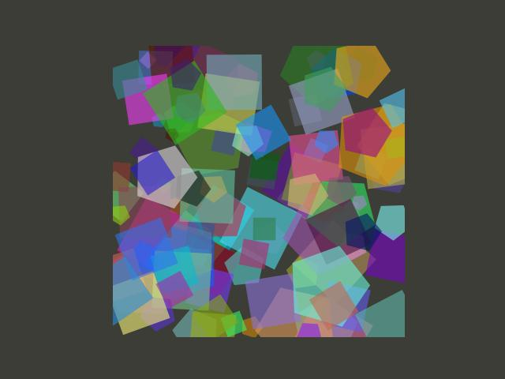
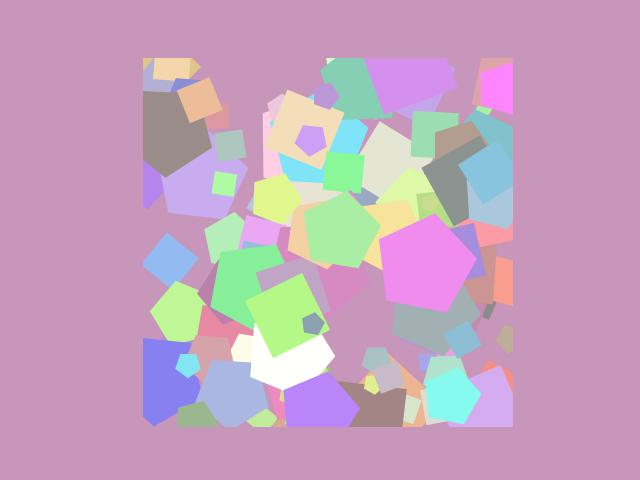
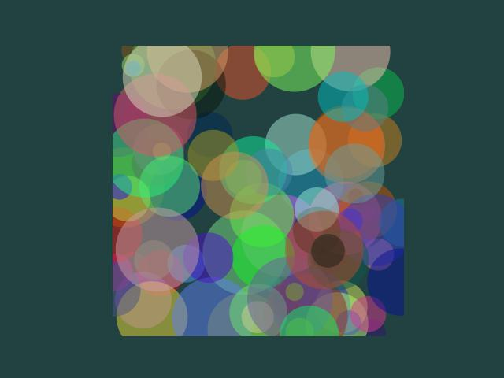
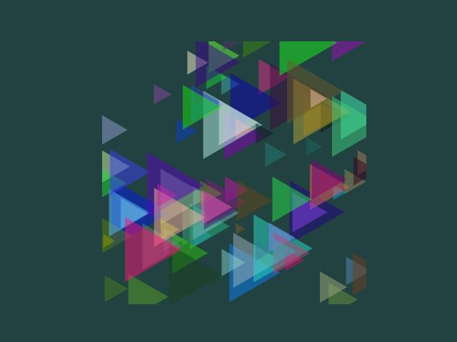

# Interactive Polygon Art Generator

This Python project allows users to interactively create abstract art using regular polygons. It integrates various Python libraries such as Matplotlib, Numpy, and ipywidgets to create a customizable artistic tool. Users can dynamically adjust multiple parameters to explore different visual outcomes and generate unique polygon-based artworks.

## Features

- **Dynamic Polygon Creation**: Generates regular polygons with adjustable properties.
- **Interactive Control**: Utilize sliders and buttons to customize the number of polygons, their sizes, colors, transparency, rotation, and positioning.
- **Color Customization**: Choose from predefined color schemes or set custom colors for polygons and the background.
- **Positioning Options**: Choose between random and grid-like arrangements for the placement of polygons.
- **Real-Time Visualization**: Instantly view changes as you adjust the controls.
- **Background Color Control**: Adjust the canvas background color using RGB sliders.

## Installation

This project requires Python 3.x and the following Python libraries:
- Matplotlib
- Numpy
- ipywidgets

You can install these libraries using pip:

```bash
pip install matplotlib numpy ipywidgets
```

## Usage

To use this tool, simply run the script in a Jupyter Notebook environment or within Visual Studio Code with Jupyter support. The interface presents various interactive widgets that you can adjust to customize the generated art. Here's a quick rundown of the steps:

1. **Adjust the number of polygons** using the slider to increase or decrease their count.
2. **Set the range for the number of sides** each polygon can have.
3. **Select a color scheme** or adjust individual RGB sliders to set custom colors for the polygons and the background.
4. **Modify the transparency** to make polygons more or less opaque.
5. **Rotate polygons** by adjusting the rotation angle for varied orientations.
6. **Choose the positioning strategy** to align polygons randomly or in a grid.
7. **Generate the art** by clicking the 'Generate Art' button.

A plot will display based on your customizations, which you can regenerate as many times as you like with different settings.

## Examples

<p align="center">
  <table>
    <tr>
      <td></td>
      <td></td>
    </tr>
    <tr>
      <td></td>
      <td></td>
    </tr>
  </table>
</p>


## Contributing

Contributions to this project are welcome! To contribute:

1. **Fork the repository** - Create a copy of this repository in your account to work independently.
2. **Create a Feature Branch** - Make a new branch to work on a new feature or a fix.
3. **Commit Your Changes** - Add your changes to your branch.
4. **Push to the Branch** - Upload your changes to your repository.
5. **Open a Pull Request** - Propose your changes to our project by opening a pull request.

## License

This project is licensed under the MIT License - see the LICENSE file for details.
